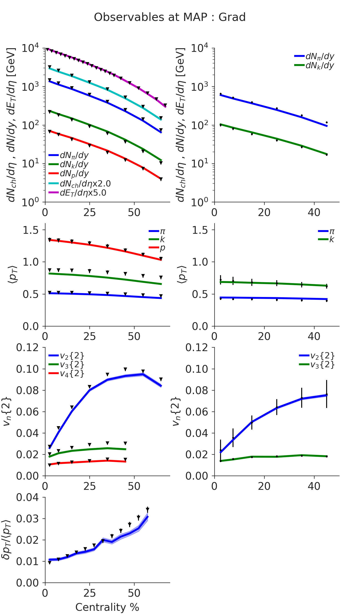
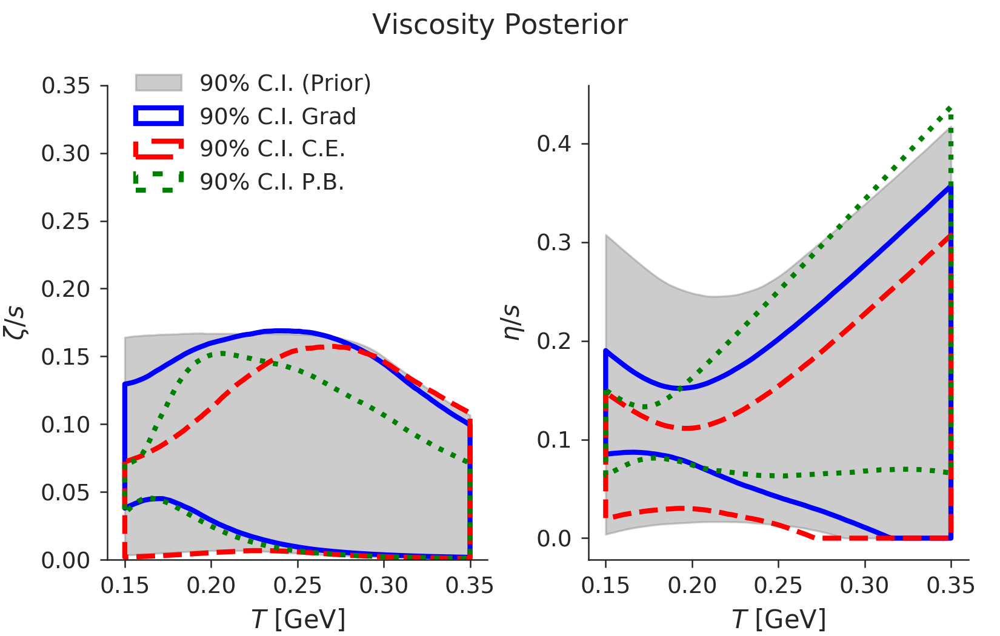
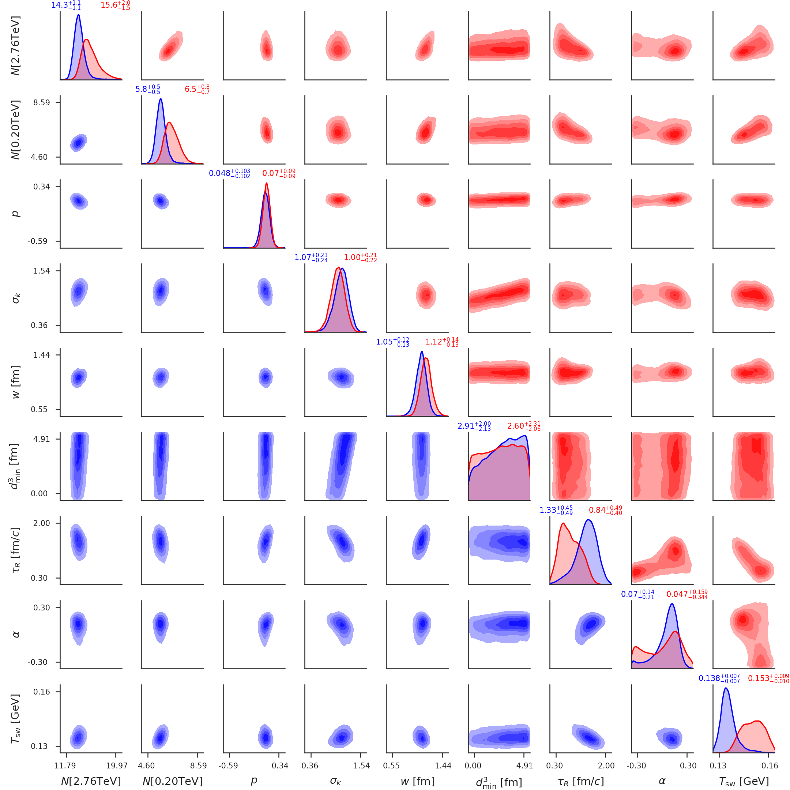
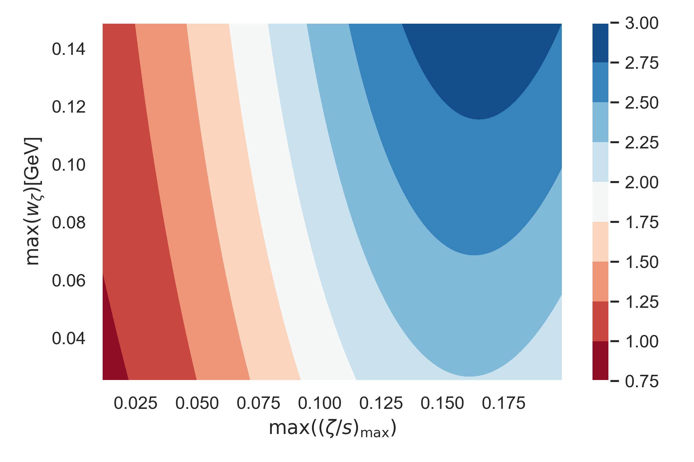
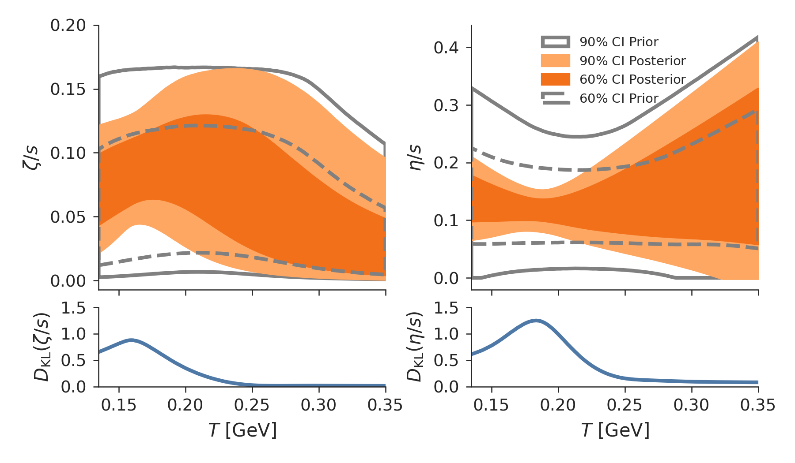

# Derek Everett
<derekeverett@gmail.com>

I have been a contributing member of the [JETSCAPE collaboration](jetscape.org), designed to tackle both physical and statistical modeling of heavy-ion collisions. 
A review of some of the work by our team can be found [here](http://jetscape.org/sims/). Many of the results that follow are currently undergoing review for final publication. 

# Table of Contents
1. [Studying Heavy-Ion Collisions](#studying_hic)
2. [Computational Modeling of Physical Systems](#comp_model)
3. [Statistical Model Emulation](#stat_emu)
3. [Statistical Inference](#stat_infer)

### Studying Heavy-Ion Collisions
Collisions of heavy nuclei at high energies performed at the [Relativistic Heavy Ion Collider](https://www.bnl.gov/rhic/) and [Large Hadron Collider](https://home.cern/science/experiments/alice)) produce an exotic state of matter called [Quark-Gluon Plasma](https://en.wikipedia.org/wiki/Quark%E2%80%93gluon_plasma). 
This phase of matter existed in the infant universe about one microsecond after the [Big Bang](https://en.wikipedia.org/wiki/Big_Bang). 

To understand the properties of this Quark-Gluon Plasma, we develop physics models and compare their predictions to data measured in the labaratory. Disentangling the properties of the collision at early times given the finally measured particles requires a systematic methodology for inference, and we use [Bayesian inference](https://en.wikipedia.org/wiki/Bayesian_inference). 

### Computational Modeling of Physical Systems 

Models for heavy-ion collisions often involve different stages, described by different underlying physics. 

A popular model for the initially deposited matter assumes that the particles expand isotropically in the plane transverse to the beam direction. 
I've developed a [freestreaming model](https://github.com/derekeverett/freestream-milne) to solve the expansion in two or three spatial dimensions. More complicated models assume that the particles can interact. I've also developed [KTIso](https://github.com/derekeverett/KTIso) to simulate the expansion of interacting particles. It determinanistically solves the [Boltzmann equation](https://en.wikipedia.org/wiki/Boltzmann_equation).  

A core component is relativistic viscous hydrodynamics. I've assisted in the continued development and maintenance of a [relativistic viscous hydrodynamic code](https://github.com/derekeverett/cpu-vh), additionally with a [version optimized for Graphics Processors](https://github.com/derekeverett/gpu-vh). 
After a phase of hydrodynamic expansion, the fluid cools and breaks apart into hadrons, which finally reach the detector. I've assisted in the development of a [model](https://github.com/derekeverett/iS3D) which simulates this [particlization process](https://arxiv.org/abs/1912.08271). 

Finally, observables are calculated which can be compared with experimental data. The observables predicted by a particular model at the point in parameter space which maximizes the likelihood is shown below. 

*Predictions of the model with Grad particlization at the point in parameter space of maximum likelihood.*

### Statistical Model Emulation

The computational physics model we use to generate includes two or three-dimensional hydrodynamic solvers as well as Monte Carlo Boltzmann solvers. We use [Markov Chain Monte Carlo](https://en.wikipedia.org/wiki/Markov_chain_Monte_Carlo) to explore the posterior of model parameters. However, given a single set of parameters, evaluation of the model can exceed fifty-thousand core-hours. This makes exploring the [likelihood function](https://en.wikipedia.org/wiki/Likelihood_function) (comparing the model-data misfit) intractable using the computational model directly.

Instead, we train a statistical surrogate or *emulator* as a proxy for our model when doing Bayesian inference.
In practice, we perform a dimensionality reduction of the observables via [principal component analysis](https://en.wikipedia.org/wiki/Principal_component_analysis). Then, each principal component is modeled by a [Gaussian process](https://distill.pub/2019/visual-exploration-gaussian-processes/).

I've written a introduction to Bayesian inference with a Gaussian process model emulator and Markov Chain Monte Carlo [here](https://github.com/derekeverett/simple_bayes_with_GP/blob/master/Infer_Shear_Viscosity_from_Flow_GPy.ipynb). It introduces some of the main ingredients to our statistcal approach in a setting with a much simpler physics model. 

I've also developed a [widget](http://jetscape.org/sims-widget) that allows us to explore how our model predictions depend on various combinations of the parameters. This is useful for interpreting the posteriors we find after performing Bayesian inference, but also for deeper understanding of the behavior of our model. 

### Statistical Inference

Given the experimental observables, we want to infer what were the properties of the Quark-Gluon Plasma. 
We can estimate the specific shear and bulk-viscosities of the Quark Gluon Plasma fluid by performing [Bayesian parameter estimation](https://indico.bnl.gov/event/6998/contributions/35770/attachments/27166/42261/JS_WS_2020_SIMS_v2.pdf).
The entire model can contain up to seventeen uncertain parameters that we want to infer. Among them are the specific shear and bulk viscosities. 

 

*The estimated specific bulk (left) and shear (right) viscosities of the Quark Gluon Plasma, as a function of temperature. The 90% credible intervals are shown for three different models in blue, red and green.*

Making robust estimates of the transport properties requires us to include the model uncertainties which enter various other stages of the collision. For instance, we must simultaneously estimate properties of the initial conditions, because they are correlated by the model with the transport properties. All together, we vary seventeen model parameters. The one-dimensional and two-dimensional posteriors for select parameters are displayed in the corner plot below. 

*The posterior of select model parameters, for two different models in blue and red.*

Besides the uncertainties given by uncertain physical parameters describing the system, there are additional sources of model uncertainty in the models that we choose. Such discrete sources of model uncertainty introduce the problem of model selection. We investigate this question by calculating the [Bayes factor](https://en.wikipedia.org/wiki/Bayes_factor) -- the odds that the experimental data were produced by a certain model relative to another model. The Bayes factor can depend sensitively on the priors chosen for each model -- if certain prior assumptions were changed, our selection of which model the data prefer could change! To address this sensitivity, the [Bayes factor surface](https://arxiv.org/abs/1809.05580) was proposed.
The idea is simply to train a Gaussian process to predict the Bayes factor between two models as a function of the prior hyperparameters. 

*The predicted log-odds (color contours) between two different models, as a function of two prior hyperparameters.*  

Finally, some of these models share common parameters, which include the specific shear and bulk viscosities. [Bayesian model averaging](https://arxiv.org/pdf/1509.08864.pdf) provides an estimate of the viscosities which marginalizes over uncertainty in the model. 

*The top row contains the Bayesian model averaged specific bulk(left) and shear(right) viscosities as a function of temperature. The bottom row contains the [Kullbak-Leibler divergence](https://en.wikipedia.org/wiki/Kullback%E2%80%93Leibler_divergence) (a.k.a. 'information gain') of our posterior with respect to our prior. At high temperatures, the data teach us very little.*  

 

